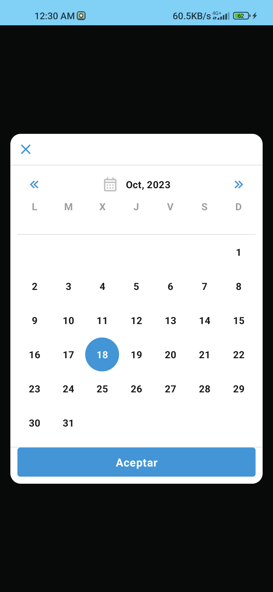
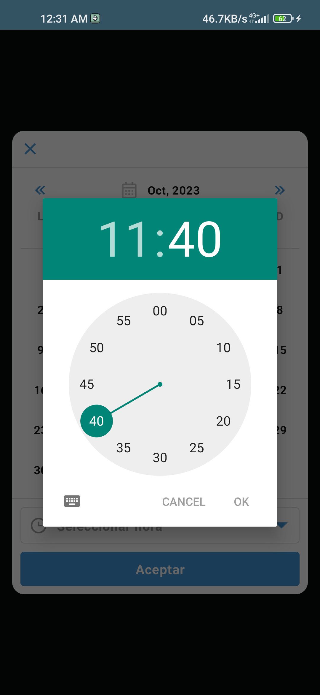
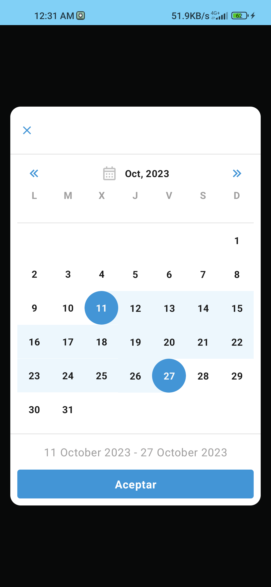
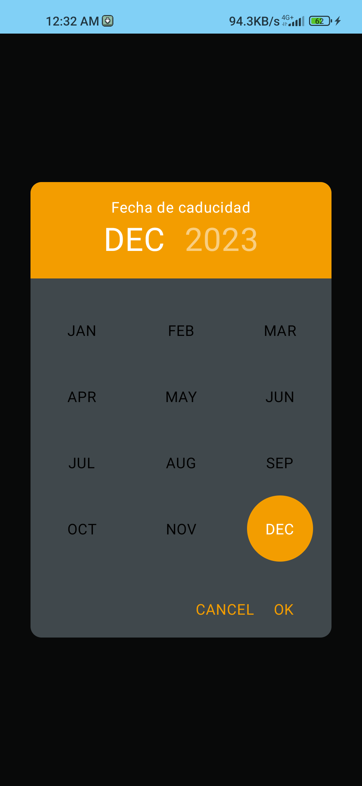

<h1 align="center">Compose Calendar</h1></br>

<p align="center">
  <a href="https://jitpack.io/#orlandroyd/ComposeCalendar/1.0.0"></a>
  

## Compose Calendar is a series of 4 UI elements that allow you to select:

### Specific date
```kotlin
var isVisible by remember { mutableStateOf(true) }
DatePickerDialog(
	visible = isVisible,
	onClose = { isVisible = false },
	onDateSelected = { isVisible = false}
)
```


### Date and time
```kotlin
var isVisible by remember { mutableStateOf(true) }
DatePickerDialog(
	visible = isVisible,
 	showSetHours = true,
	onClose = { isVisible = false },
	onDateSelected = { isVisible = false}
)
```


### Date range
```kotlin
var isVisible by remember { mutableStateOf(true) }
DateRangePickerDialog(
	visible = isVisible,
	onClose = { isVisible = false },
	onDatesSelected = { isVisible = false}
)
```


### Only the month and year
```kotlin
var isVisible by remember { mutableStateOf(true) }
MonthYearPickerDialog(
	visible = isVisible,
	onClose = { isVisible = false },
	onDateSelected = { isVisible = false}
)
```


## Download
<a href="https://jitpack.io/#orlandroyd/ComposeCalendar/1.0.0"></a>

### Gradle

Add the dependency below to your module's `build.gradle` file:
```gradle
dependencies {
    implementation 'com.github.OrlanDroyd:ComposeCalendar:1.0.0'
}
```
Add a repository in your `settings.gradle` file:
```
dependencyResolutionManagement {
    repositories {
        ...
        maven { url 'https://jitpack.io' }
    }
}
```
## Usage

There are only one required parameter: `visible`.

```kotlin
var isVisible by remember { mutableStateOf(true) }
DatePickerDialog(
	visible = isVisible,
	onClose = { isVisible = false },
	onDateSelected = { isVisible = false}
)
```

You can also modify other parameters, such as colors, shading and surface

## Like what you see? :yellow_heart:
⭐ Give a star to this repository. <br />
☕ Buy me a coffee: https://ko-fi.com/orlandroyd

# License
```xml
Designed and developed by 2023 OrlanDroyd (Orlando Peña Fernández)

Licensed under the Apache License, Version 2.0 (the "License");
you may not use this file except in compliance with the License.
You may obtain a copy of the License at

   http://www.apache.org/licenses/LICENSE-2.0

Unless required by applicable law or agreed to in writing, software
distributed under the License is distributed on an "AS IS" BASIS,
WITHOUT WARRANTIES OR CONDITIONS OF ANY KIND, either express or implied.
See the License for the specific language governing permissions and
limitations under the License.
```
